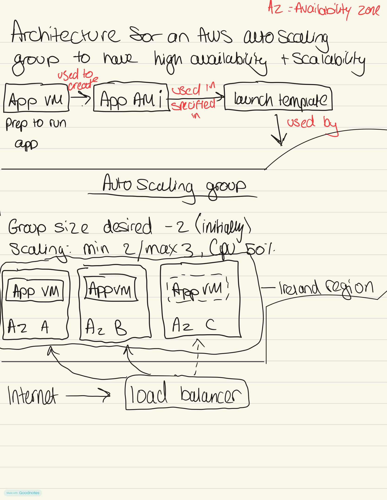

# Autoscaling - TicTacToe App

## 1.Steps: Auto Scaling Group(ASG)
 
1. **EC2 → Auto Scaling Groups → Create Auto Scaling group**
   - Name: `tech610-ky-ttt-app-asg`
   - Confirm it's using the launch template → **Next**
2. **Network:**
   - Default VPC
   - Select all 3 subnets/AZs (1a, 1b, 1c) — spreading across AZs means an entire zone going down doesn't take your app offline
   - Instance distribution: balanced best effort 
   
   → **Next**

3. **Load balancing:**
   - Attach to a new load balancer → Application Load Balancer
   - Name: `tech610-ky-ttt-app-asg-lb`
   - Internet-facing
   - Listener: HTTP :80

   - New target group: `tech610-ky-ttt-app-asg-lb-tg`
   - Turn on **Elastic Load Balancing health checks** (important — see Section 5)
   - Health check grace period: **90 seconds** — this gives each new instance time to boot, run the user data script, and get PM2 running before the ALB starts judging it as unhealthy 
   
   → **Next**

4. **Group size and scaling:**
   - Desired capacity: 2
   - Min: 2, Max: 3
   - Target tracking scaling policy on `tech610-ky-ttt-app-asg-lb-tg`, target value **50** (average request/CPU load) — this is what adds the 3rd instance automatically under load and scales back to 2 once load drops

   - Instance warm-up: 90s — new instances aren't counted toward the scaling metric until they've had time to actually start serving traffic, so the ASG doesn't over-scale based on instances that aren't ready yet
   - No additional scaling policy 
   
   → **Next**

5. **Tags:** Name = `tech610-ky-ttt-app-asg-HA-SC` → **Create**
### Get your app URL
1. Open the ASG → **Integrations** tab → click through to **Load balancer target groups** → click through to the **Load balancer**.
2. Copy the **DNS name**.
3. Paste it into your browser — **make sure it's `http://`, not `https://`**





---

## What is a load balancer and why is it needed

A load balancer sits in front of your EC2 instances, distributing incoming
traffic and giving users one stable address to connect to regardless of
which instances are actually running.

Key benefits of a Load Balancer:

* **Single URL** - users always visit the same address regardless of how
  many instances are running

* **Health checking** - automatically stops sending traffic to unhealthy
  instances

* **Even distribution** - spreads traffic so no single instance gets
  overloaded

* **High availability** - if one instance fails, traffic is rerouted to
  healthy ones instantly

---

## How to manage instances

From the ASG's **Instance management** tab:
- **View health/lifecycle state** — each instance shows `Pending`,
  `InService`, or `Terminating`, plus its target group health status.

---

## Creating a healthy / unhealthy instance (for testing)

The target group sends an HTTP health check to each instance on a set interval.
- **Healthy** = the app responds with a success status (200-399) for
  enough consecutive checks in a row.
- **Unhealthy** = the request times out, gets refused, or errors, for
  enough consecutive checks in a row. 
  
  With elastic load balancing health checks enabled on
  the ASG, an unhealthy instance gets terminated and replaced.

**To make an instance unhealthy on purpose:**
```bash
pm2 stop index.js
```
This stops the app listening entirely —
(`pm2 kill` works too — clears PM2 completely.)

**To restore it to healthy:**
```bash
cd /tech610-tic-tac-toe/app
pm2 start index.js
```
It flips back to healthy after the next couple of successful checks —
assuming the ASG hasn't already terminated it first.

---

## Steps to SSH into an instance

1. EC2 console → Instances → select one of the ASG's instances → copy its
   **Public IPv4 address**.
2. From your terminal:
```
ssh -i your-key.pem ec2-user@<PUBLIC_IP>
```

---

## Deleting everything step by step

1. **Delete the Auto Scaling Group** (`tech610-ky-ttt-app-asg`) — terminates
   all managed instances automatically.

2. **Delete the Load Balancer** (`tech610-ky-ttt-app-asg-lb`).

3. **Delete the Target Group** 
(`tech610-ky-ttt-app-asg-lb-tg`) 

4. **Delete the Launch Template** (`tech610-ky-for-asg-ttt-app-lt`).
optional as you may want to reuse

5. Confirm the EC2 **Instances** page shows nothing left running.