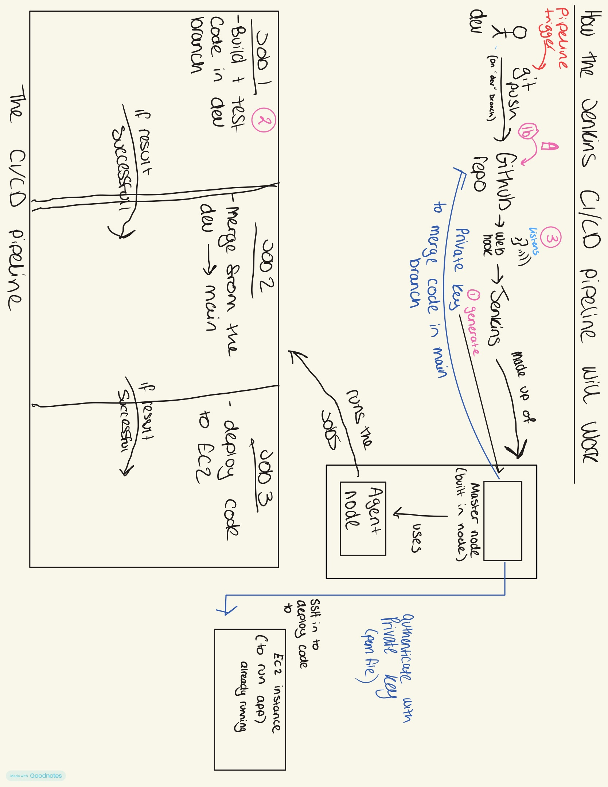

# 3-Job CI/CD Pipeline to Deploy TTT App

- [3-Job CI/CD Pipeline to Deploy TTT App](#3-job-cicd-pipeline-to-deploy-ttt-app)
  - [Pipeline diagram](#pipeline-diagram)
  - [Set up](#set-up)
  - [Job 1 — CI: Test](#job-1--ci-test)
    - [1. Generate an SSH key pair for SCM](#1-generate-an-ssh-key-pair-for-scm)
    - [2. Get the public key and add it to GitHub](#2-get-the-public-key-and-add-it-to-github)
    - [3. Jenkins job configuration](#3-jenkins-job-configuration)
  - [Job 2 CI : merge](#job-2-ci--merge)
    - [Post-build Actions — Git Publisher (plugin is the preferred way)](#post-build-actions--git-publisher-plugin-is-the-preferred-way)
  - [Job 3 — CD: Deploy](#job-3--cd-deploy)
  - [Webhook \& How the Pipeline Is Triggered](#webhook--how-the-pipeline-is-triggered)
  - [Blockers](#blockers)
    - [1. Jenkins Git Publisher](#1-jenkins-git-publisher)
    - [2. Job 3 — Nested App Directory](#2-job-3--nested-app-directory)

## Pipeline diagram 

 
 
 ## Set up
The pipeline is pslit into 3 jobs:
1. test
2. merge
3. deploy

**Benefits:**
- Broken code never reaches main
  - if tests fail in job 1, nothung gets merged or deployed 
- deployment is automated 
  - git push to dev no manual SSH
- catch issues early
- pipeline is repeatable 

**Benefits for an organisation:**
 
- Faster time to market
- Reduced risk 
- Consistency — every deploy runs identical steps, every time
**The goal:** get code changes deployed to users as quickly as possible.


 
## Job 1 — CI: Test
 
### 1. Generate an SSH key pair for SCM
 
```bash
ssh-keygen -t ed25519 -a 100 -C "jenkins@ttt-scm-3job-cicd"
```
 
- **Name for key:** `kyram-jenkins-2-gh-ttt-app`
- 
### 2. Get the public key and add it to GitHub
 
```bash
cat kyram-jenkins-2-gh-ttt-app.pub
```
 
Added under GitHub → Settings → SSH and GPG keys.
 
### 3. Jenkins job configuration
 
- **Name:** `kyram-ttt-job1-ci-test`
- **Discard old builds:** Max # of builds to keep = 5
- **GitHub project → Project url:** `https://github.com/Kyram6/tech610-ttt-app-cicd-jenkins/` 

    (.git removed, replaced with /)

**Source Code Management — Git**
- **Repository URL:** `git@github.com:Kyram6/tech610-ttt-app-cicd-jenkins.git`
- **Credentials:** Kind = SSH Username with private key
  - ID: `kyram-jenkins-2-gh-ttt-app`
  - Username: `kyram-jenkins-2-gh-ttt-app (to read/write repo)`
  - Private key: entered directly — full output of `cat kyram-jenkins-2-gh-ttt-app` 
  
  (including the 5 hyphens at the start and end (`-----BEGIN...` / `-----END...`))

- **Branch Specifier:** `*/dev`
  
**Build Triggers**
- Tick 'GitHub hook trigger for GITScm polling'
  
**Build Environment**
- Tick 'Provide Node & npm bin/ folder to PATH'
- NodeJS version: **20**
  
**Build Steps — Execute Shell**
 
```bash
cd app
npm ci
npm test
```
 

---

## Job 2 CI : merge

if Job 1 passes, job 2 merges the tested `dev` branch into `main` and pushes the result to GitHub.
 
- **Name:** `kyram-job2-ttt-ci-merge`
- **Description:** If tests pass on Job 1, Job 2 runs and merges `dev` into `main`.
- **Discard old builds:** Max # of builds to keep = 5
- **GitHub project → Project url:** `https://github.com/Kyram6/tech610-ttt-app-cicd-jenkins/`
**Source Code Management — Git**
- **Repository URL:** `git@github.com:Kyram6/tech610-ttt-app-cicd-jenkins.git`
- **Credentials:** `kyram-jenkins-2-gh-ttt-app (to read/write to repo)`
- **Branch Specifier:** `*/dev`

### Post-build Actions — Git Publisher (plugin is the preferred way)
 
- Push only if build succeeds
- Merge results pushed to `main`
- Branches → branch to push: `main`
- Target remote name: `origin`
- **Build other projects:** trigger Job 3 (`kyram-job3-cd-deploy`), condition: Stable

**Post-build Actions**
- **Build other projects:** `kyram-ttt-job2-ci-merge`
- Condition: **Trigger only if build is stable**

apply and save then build 

go to terminal and nano README.md
add a line to push 
git add .
git commit -m "add 1st line to readme to test webhook"
git push --set-upstream origin dev            (can use git push after this)

forgot to add in webhook - http://54.73.244.32:8080//github-webhook/
ip of jenkins server. 

## Job 3 — CD: Deploy
 
if Job 2 succeeds, job 3 copies the tested, merged code to the EC2 instance and restarts the app via PM2.
 
- **Name:** `kyram-job3-cd-deploy`
- **Description:** Job 3 deploying app to EC2 instance.
- **Discard old builds:** Max # of builds to keep = 5
- **GitHub project → Project url:** `https://github.com/Kyram6/tech610-ttt-app-cicd-jenkins/`
**Source Code Management — Git**
- **Repository URL:** `git@github.com:Kyram6/tech610-ttt-app-cicd-jenkins.git`
- **Credentials:** `kyram-jenkins-2-gh-ttt-app`
- **Branch Specifier:** `*/main` (deploying the merged, tested code — not `dev`)
**Build Triggers**
- Ticked: **Build after other projects are built**
  - Projects to watch: `kyram-ttt-job2-ci-merge`
  - Condition: **Trigger only if build is stable**
  
> Start App AMI

**Build Environment — Authentication to EC2**
- Ticked: **SSH Agent**
- Added the existing EC2 key pair (`kyram-tech610-key.pem`) as a Jenkins credential
  - ID/name: `kyram-ec2-deploy-key`
**Build Steps — Execute Shell**

```bash
scp -o StrictHostKeyChecking=no -r app/* ubuntu@3.253.85.77:/home/ubuntu/app/
ssh -o StrictHostKeyChecking=no ubuntu@3.253.85.77 << 'EOF'
cd /home/ubuntu/app
npm ci
pm2 restart app || pm2 start index.js --name app
EOF
```

**Testing deploys — front page timestamp**
 
`server.js` has a built-in test hook: `getFooterVersionStamp()` 
 
```js
const configuredTimestamp = String(process.env.APP_FOOTER_TIMESTAMP || '').trim();
```
 
```bash
nano +100 app/server.js
```
Change date and time 
 
To prove a new deploy:
```bash
git add .
git commit -m "update test timestamp for deploy verification"
git push origin dev
```
---
## Webhook & How the Pipeline Is Triggered
 
A webhook lets GitHub notify Jenkins the instant code is pushed.
 
**Setup:**
- GitHub repo → Settings → Webhooks → Add webhook
- Payload URL: `http://<jenkins-server-ip>:8080/github-webhook/`
- Content type: `application/json`
- Trigger: on push events
  
**How the trigger chain works:**
 
1. Developer pushes a commit to the `dev` branch
2. GitHub's webhook fires, notifying Jenkins immediately
3. Job 1 (which has "GitHub hook trigger for GITScm polling" ticked) starts automatically
4. If Job 1 is stable → Job 2 automatically starts ("Build after other projects are built")
5. If Job 2 is stable → Job 3 automatically starts, same mechanism

   
Job 3 only watches Job 2, since Job 2 only goes stable if Job 1 also passed

**Testing the webhook fired correctly**
 
```bash
nano README.md
# add a line
git add .
git commit -m "add 1st line to readme to test webhook"
git push --set-upstream origin dev
# (git push alone is enough for subsequent pushes)
```
 
Pushing this small change and watching Job 1 start automatically on the Jenkins dashboard confirmed the webhook was working end-to-end.


## Blockers
 
### 1. Jenkins Git Publisher 
 
Job 2's Git Publisher step failed with:
 
```
! [rejected] HEAD -> main (non-fast-forward)
error: failed to push some refs to 'github.com:...'
```

`README.me` file was accidentally created and added to both branches, then deleted but only on `main` not on `dev`. That deletion became its own commit on `main` that `dev` never had:
 
```text
main: A --- B (README.me added) --- C (README.me deleted)
dev:  A --- B (README.me added)
```
 
Pushing `dev` straight into `main` would have overwritten history and effectively brought the file back — Git blocked it.
 
**Fix — sync the branches:**
```bash
git checkout main
git pull origin main
 
git checkout dev
git merge main
 
git push origin dev
```
 
**Why not Force Push instead?** Force Push overwrites remote history outright — commit `C` would simply vanish. Syncing branches keeps history intact and is safer for a shared repo.
 
avoid direct changes to `main` in a CI/CD workflow — make changes on `dev`.

### 2. Job 3 — Nested App Directory
 
**Problem:** deployment succeeded with no errors, but changes weren't appearing on the EC2 instance. The original command:
 
```bash
scp -r app ubuntu@EC2:/home/ubuntu/app
```
 
copied the whole `app` folder into the existing `/home/ubuntu/app`, creating a nested `/home/ubuntu/app/app`. PM2 was running the outer copy (`/home/ubuntu/app/index.js`), while Jenkins kept updating the nested one — so the running app never received the update.
 
**Solution:** copy the folder's contents instead:
```bash
scp -r app/* ubuntu@EC2:/home/ubuntu/app/
```
 
**How it was diagnosed:**
1. `pm2 status` — confirmed the app was running
2. `pm2 describe app` — showed the script path being used
3. `grep -n "configuredTimestamp" server.js` — confirmed the *file* had the new value
4. `curl localhost:3000 | grep version-stamp` — showed the *running app's output* still had the old value, proving a mismatch between file and running process
5. `ls -la ~/app` — revealed the unexpected nested `app/app` directory
6. `diff ~/app/server.js ~/app/app/server.js` — confirmed two different versions existed
7. Traced the root cause to the `scp` command copying the folder itself, not its contents
8. Fixed the command, redeployed, and the new timestamp appeared
   


