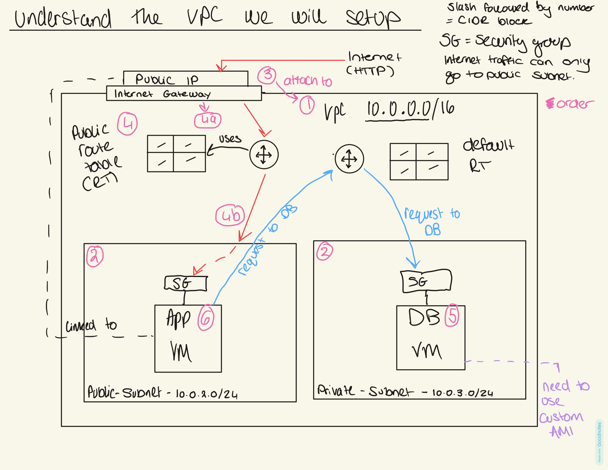
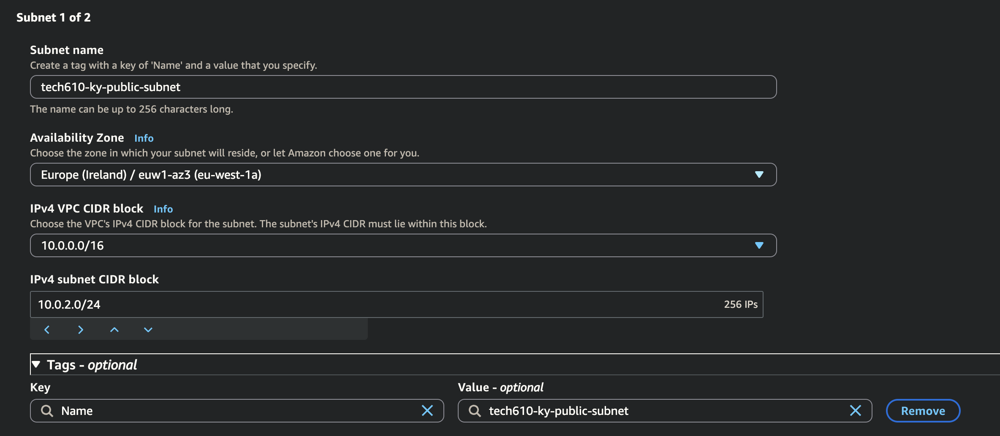
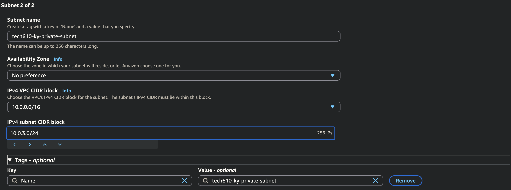
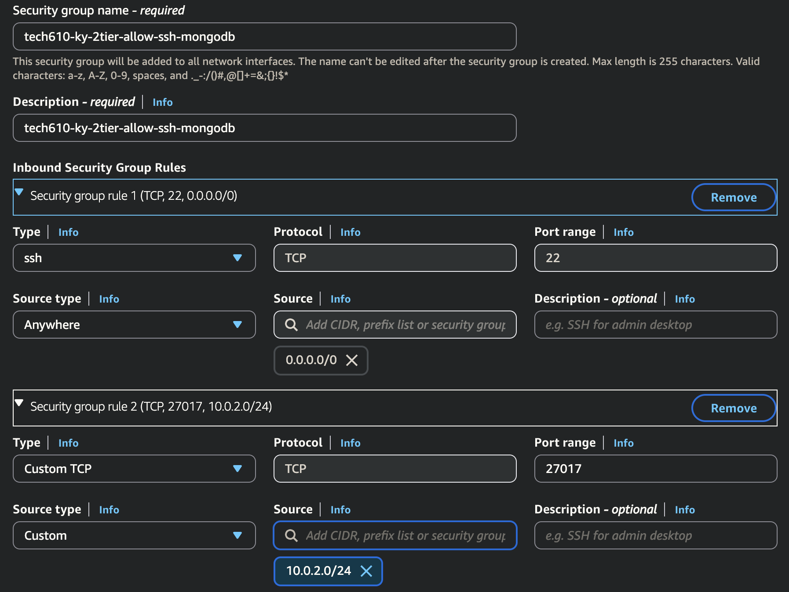
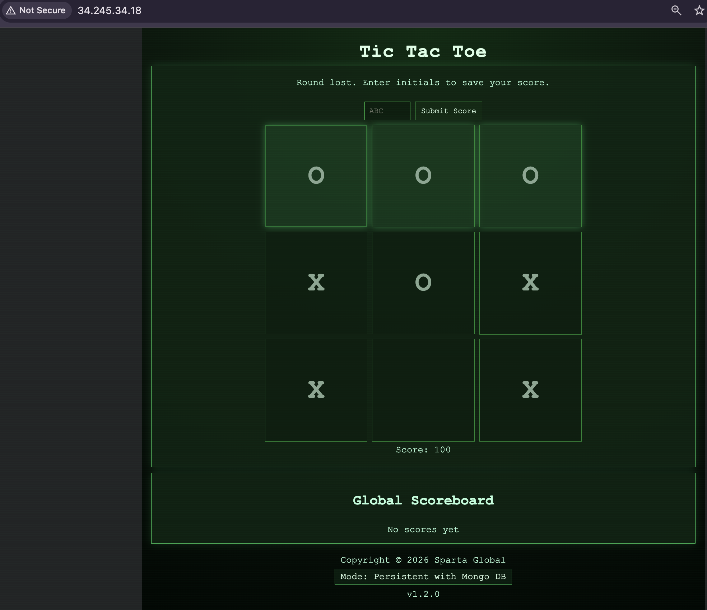
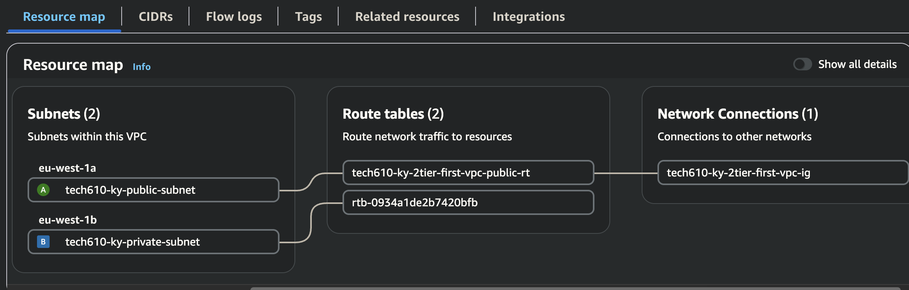
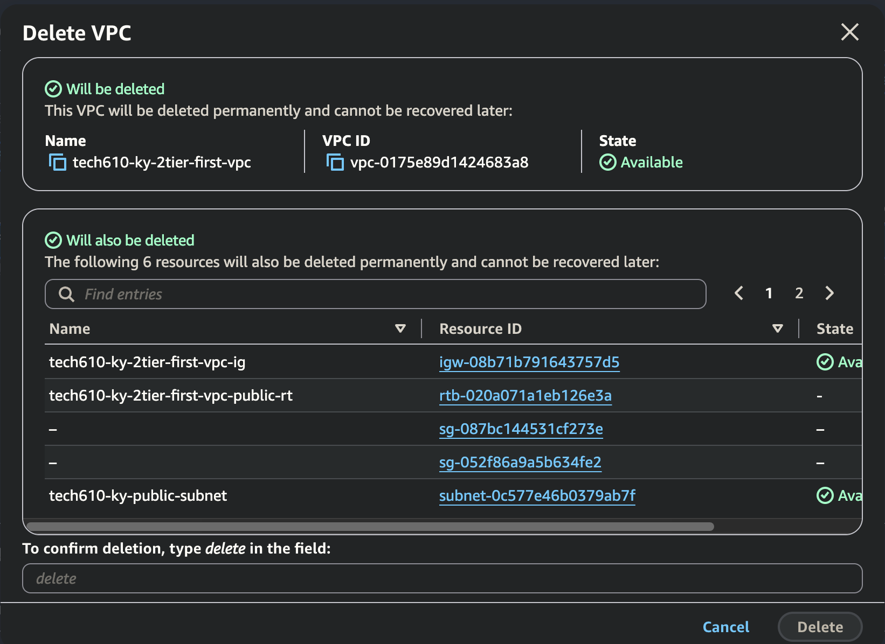

# 2-Tier VPC architecture - TikTakToe App



(need custom ami as can't connect to internet)

## Step by step 

### 1. Create the VPC
- **VPC → Create VPC → VPC only**
- Name: `tech610-ky-2tier-first-vpc`
- IPv4 CIDR: `10.0.0.0/16`


### 2. Create subnets
Click Subnets on the tab to the left, then Create Subnet 
Two subnets, in different AZs, carved out of the VPC's CIDR range:
 
**Public subnet**
- VPC: your VPC
- Name: `tech610-ky-public-subnet`
- AZ: `eu-west-1a`
- CIDR: `10.0.2.0/24`



> Add new subnet to create the 2nd subnet 

**Private subnet**
- VPC: your VPC
- Name: `tech610-ky-private-subnet`
- AZ: `eu-west-1b`
- CIDR: `10.0.3.0/24`



### 3. Create an Internet Gateway
- **VPC → Internet Gateways → Create**
- Name: `tech610-ky-2tier-first-vpc-ig`

### 4. Attach it to the VPC
- Select the gateway → **Attach to a VPC** → select your VPC

### 5. Create a route table for the public subnet
- **Route Tables → Create route table**
- Name: `tech610-ky-2tier-first-vpc-public-rt`
- VPC: your VPC
- **Subnet associations** → edit → associate **only the public subnet**
  
- **Routes** → edit → add:

```
  Destination: 0.0.0.0/0
  Target: Internet Gateway (your internet gateway)
```

Save changes

### 6. Launch the DB instance
- Launch from your DB AMI
- Name: `tech610-ky-in-2tier-vpc-ttt-db`
- Network settings: your VPC → **private subnet**
- New security group: `tech610-ky-2tier-allow-ssh-mongodb`
  - Custom TCP, port `27017`, source `10.0.2.0/24` (the public subnet —
    i.e., only the app tier can reach Mongo, nothing else)



> Launch Instance.

### 7. Launch the app instance
- Launch from your app AMI
- Name: `tech610-ky-in-2tier-vpc-ttt-app`

- Network settings: your VPC → **public subnet** → **enable auto-assign
  public IP** (needed since this instance must be reachable directly)

- New security group: `tech610-ky-2tier-vpc-allow-ssh-my-ip-http`
  - HTTP (80) from anywhere
  - SSH (22) from **My IP** only

- User data:
```bash
  #!/bin/bash
  export MONGODB_URI=mongodb://[PRIV DB IP]:27017/tic-tac-toe
 
  cd /tech610-tic-tac-toe
  cd app
 
  pm2 kill
  pm2 start index.js
```



### 8. Confirm the resource map
AWS's VPC dashboard has a **Resource Map** tab that visually shows how your
VPC, subnets, route tables, and gateway all connect 



## Shutting everything down
 
1. Terminate the app instance

2. Terminate the DB instance
3. Go to your VPC → Delete VPC.

    This cascades through and deletes the
   subnets, route tables, internet gateway and security groups.
   

