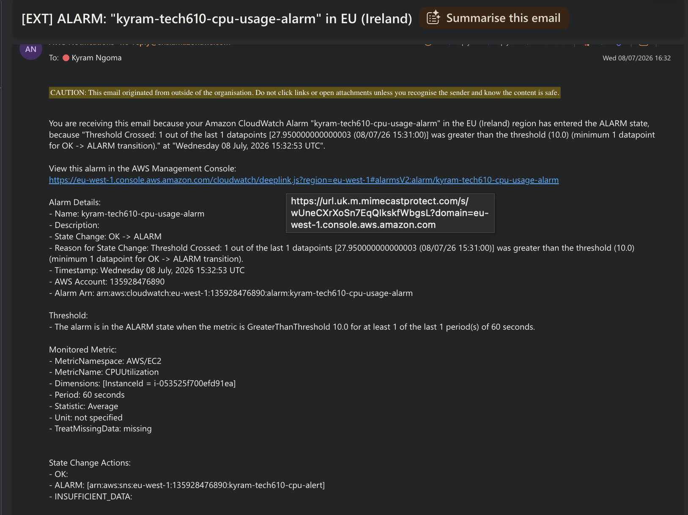

# Setting Up a CPU Usage Alarm
 
Step 1 — Go to CloudWatch Alarms
1. AWS Console → search for CloudWatch
2. Alarms → All alarms
3. Create alarm

Step 2 
1. Select metric
2. Select EC2 → Per-Instance Metrics
3. Search your instance ID
4. Select CPUUtilization
5. Select metric

Step 3 — Configure the Metric
- Statistic: Average
- Period: 1 minute (checks every minute)
Under conditions:
- Threshold type: Static
- Whenever CPUUtilization is: Greater than
- Threshold value: 10 (set based on load testing)
 
Step 4 — Set Up Email Notification
1. Select In alarm
2. Create new topic
3. Name: `kyram-tech610-cpu-alert`
4. Enter your email address
5. Create topic

> Check email and confirm the subscription — wont send untill you do
 
Step 5 — Name Your Alarm
- Name: `kyram-tech610-cpu-usage-alarm`
- Create alarm

Step 6 — Trigger the Alarm with Load Testing
 
SSH into the app VM and run:
```bash
ab -n 20000 -c 300 http://<your-app-IP>/
```
 
Wait a few minutes — the alarm triggers once CPU exceeds 10% and sends an email notification.

### Email Notification


## Clean up
 
Once you're done testing, clean up the AWS resources you created so nothing keeps running (and costing money) in the background.
 
1. Delete the CloudWatch alarm
   - CloudWatch → Alarms → All alarms
   - Select `kyram-tech610-cpu-usage-alarm` → Actions → Delete

2. Delete the SNS topic and subscription
   - SNS → Topics
   - Select `kyram-tech610-cpu-alert` → Delete
   - This also removes the email subscription tied to it

3. Delete dashboard 
   - CloudWatch → Dashboards
   - Select your dashboard → Delete
   
4. Stop or terminate the EC2 instance
   - EC2 → Instances
   - Select your instance → Instance state → Stop (keeps it, but no charges while stopped) or Terminate (removes it completely)
   - Terminate if you no longer need the instance at all; stop if you might come back to it later