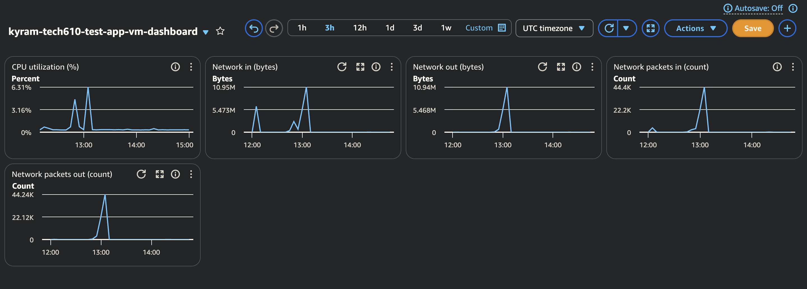

# Monitoring, alert management and auto scaling 

###  What is performance testing?

* About asking "is the app working well generally?"
broad testing to see how an application behaves in real world conditons vs functional testing ( individual features working correctly)
---

Performance testing incldues:
- Load testing 
    * About asking "can the app handle the usual amount of traffic?"
    * simulate expected and realistic traffic levels to see if the app performs acceptably 
    * latency low, no errors, normal limits 

- Stress testing 
    * About asking "how much traffic can the app handle before it breaks and what happens when it does break?"
    * Pushing traffic beyond normal levels to find apps breaking point 
    * observe how it fails - crash, errors, timeouts..

---

### What is worst to best in terms of monitoring and responding to load/traffic.

Least to most effective:


1. Not using monitoring - No visibility -  Only find somethings wrong when app is already down.

2. Dashboard - Passive - someone has to be actively watching it to notice a problem. Not great for catching issues in real time unless someone is constantly staring at it.

- Alert/Alarm - System watches itself - Thresholds are set so when theyre crossed you are notified automatically(email..etc) No one needs to be watching it. Still requires a human to act on alert. (think of a fire alarm going off).

- Autoscaling - Notifies and responds automatically - when thresholds are crossed, it detects the problem and fixes it. (Think of sprinklers that start when a fire alarm goes off).

---

### How you setup a dashboard:

- Start an instance(we used our images from earlier)

- Go to monitoring 

- Create dashboard 

- Set the time range and refresh interval 

---
## What we did in the Code Along 

We ran a load test against an EC2 instance using **Apache Bench (`ab`)**, a command-line tool for benchmarking HTTP servers.
 
**1. Updated packages and installed the load testing tool after SSH'ing in:**
```bash
sudo apt update
sudo apt update -y
sudo apt-get install apache2-utils
```
`apache2-utils` is the package that provides the `ab` (Apache Bench) command.
 
**2. Ran a baseline load test:**
```bash
ab -n 1000 -c 100 http://108.131.125.28/
```
- `-n 1000` → send a total of 1,000 requests
- `-c 100` → send them with 100 concurrent requests at a time
- Target: the EC2 instance's public IP

This represents a moderate load — a first check of how the instance handles a reasonable burst of concurrent traffic.
 
**3. Ran a heavier load test:**
```bash
ab -n 10000 -c 200 http://108.131.125.28/
```
- `-n 10000` → 10,000 total requests (10x the first test)
- `-c 200` → 200 concurrent requests (2x the first test)

**4. Ran an even heavier test:**
```bash
ab -n 20000 -c 300 http://108.131.125.28/
```
- `-n 20000` → 20,000 total requests (20x the first test)
- `-c 300` → 300 concurrent requests (3x the first test)

Each step moved further past normal traffic levels.. from a **load test** (can it handle usual traffic?) toward a **stress test** (how much can it take, and how does performance change as it's pushed?).
 
*(While these ran, we had the AWS Console open, watching the EC2 instance's CloudWatch dashboard.)*
 
### Results
 
| Test | Requests | Concurrency | Time Taken | Req/sec | Mean Time/Request | Failed Requests | Longest Request (max) |
|---|---|---|---|---|---|---|---|
| 1 | 1,000 | 100 | 1.010 s | 989.96/sec | 101.0 ms | 0 | 119 ms |
| 2 | 10,000 | 200 | 6.697 s | 1,493.13/sec | 133.9 ms | 0 | 227 ms |
| 3 | 20,000 | 300 | 13.931 s | 1,435.64/sec | 209.0 ms | 0 | 783 ms |
 
**What this shows:**
- **Zero failed requests across all three tests** — nginx never dropped a request outright, even at 300 concurrent connections.

- **Latency got noticeably worse under heavier load** — mean time per request roughly doubled from test 1 (101 ms) to test 3 (209 ms).

- **The tail latency is the clearest warning sign** — the slowest request (max) went from 119 ms → 227 ms → **783 ms** between tests 1, 2, and 3. The server was approaching its limit.

---

## How a combination of load testing and the dashboard helped us

The dashboard showed why: CPU and network usage on the instance climbing as we pushed more traffic at it.

The dashboard offers visibility to see whats happening inside the VM

Put together, this showed that the server slows down well before it actually starts failing requests. So watching for "no failed requests" isn't enough on its own — you need to watch the dashboard to catch the slowdown early.

This combination is also what tells you:

- Where the breaking point is the traffic level where things start to degrade.
- What thresholds make sense — e.g., if CPU hits 90% right before things slow down, that's a sensible alert threshold.
- When autoscaling should kick in 

--- 

