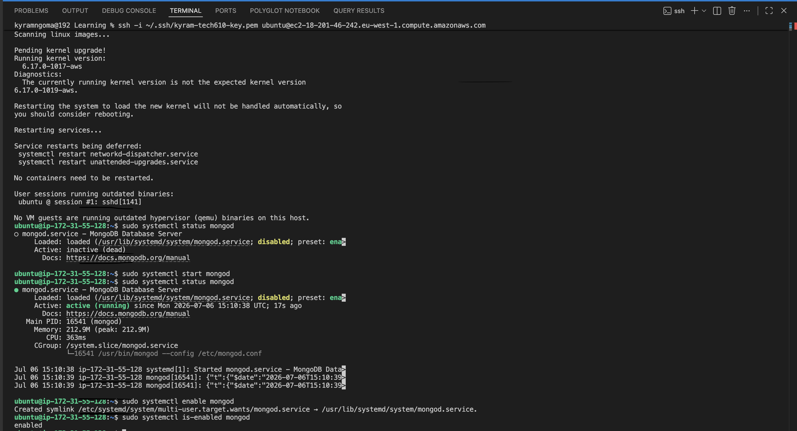

 # Step-by-step breakdown
 
### 1. Update the package index
```
sudo apt-get update -y
```
Refreshes Ubuntu's available packages and versions. Must run before installing anything, otherwise you may pull outdated or missing package info.
 
### 2. Upgrade existing packages
```bash
sudo apt-get upgrade -y
```
Applies any pending updates to already-installed packages.
 
### 3. Add MongoDB's GPG signing key
```bash
curl -fsSL https://pgp.mongodb.com/server-8.0.asc | \
   sudo gpg -o /usr/share/keyrings/mongodb-server-8.0.gpg \
   --dearmor
```
Lets APT verify that MongoDB's packages are authentic.
 
### 4. Register MongoDB's APT repository
```bash
echo "deb [ arch=amd64,arm64 signed-by=/usr/share/keyrings/mongodb-server-8.0.gpg ] https://repo.mongodb.org/apt/ubuntu noble/mongodb-org/8.2 multiverse" | sudo tee /etc/apt/sources.list.d/mongodb-org-8.2.list
```
Adds MongoDB's official package repository as a new source, since MongoDB isn't in Ubuntu's default repos.
 
### 5. Refresh the package index again
```bash
sudo apt-get update
```
Needed so APT sees the newly added repo.
 
### 6. Install MongoDB (pinned to version 8.2.5)
```bash
sudo apt-get install -y \
   mongodb-org=8.2.5 \
   mongodb-org-database=8.2.5 \
   mongodb-org-server=8.2.5 \
   mongodb-mongosh \
   mongodb-org-shell=8.2.5 \
   mongodb-org-mongos=8.2.5 \
   mongodb-org-tools=8.2.5 \
   mongodb-org-database-tools-extra=8.2.5
```
Installs the full MongoDB toolset — server, shell (`mongosh`), mongos (sharding router), and management tools — all pinned to the same version (8.2.5) for consistency across environments.
 
### 7. Check, start, and verify MongoDB's status
```bash
sudo systemctl status mongod

sudo systemctl start mongod

sudo systemctl status mongod # check if running
```
`mongod` is the MongoDB daemon (the actual database server process).`status` checks if it's currently stopped/inactive after install; `start` launches it; the second `status` check confirms it's now running.
 
### 8. Enable MongoDB to start on boot
```bash
sudo systemctl enable mongod #enable mongod
```
Ensures `mongod` automatically starts if the VM reboots, without needing to manually run `systemctl start` again.
 

